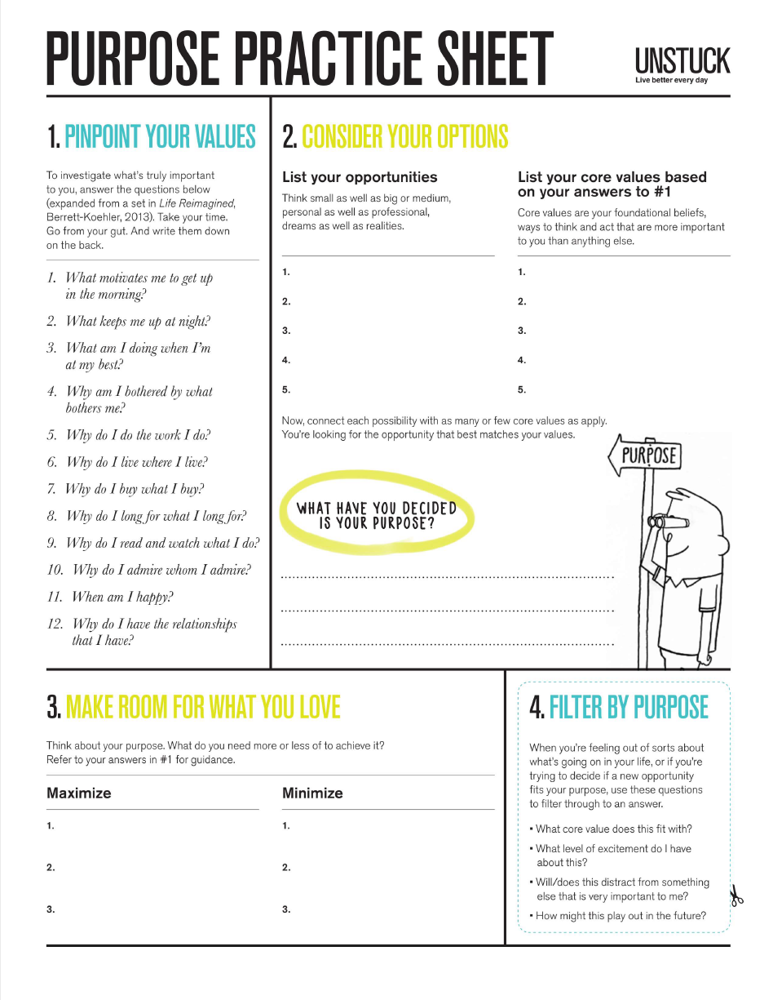

### Pinpoint Your Values

- What motivates me to get up in the morning? - I enjoy working hard
- What keeps me up at night? - Thinking about different ways I could've implemented code
- What am I doing when I'm at my best? I'm relaxing with my family or my fiance
- Why am I bothered by what bothers me? I am a quite restless person
- Why do I do the work I do? I think writing software is very interesting and allows me to be creative
- Why do I live where I live? I love the University that I go to
- Why do I buy what I buy? I stick to the necessities due to not having much money
- Why do I long for what I long for? I would like to provide for my family
- Why do I read and watch what I do? I want to become a better software engineer
- Why do I admire whom I admire? I admire people who live out their faith and convictions
- When am I happy? When I am spending time with my family
- Why do I have the relationships that I have? I am trying to encourage the people around me 
	
### List your opportunities

- I would like to work at a big tech company
- I want to have time to invest in my spiritual growth
- I want to have a career where I have a lot of time to spend with my family and my fiance
- I want to provide for my mother and brothers
- I've been given the opportunity to attend college and multiple internships

### List your core values based on your answers to #1
- Family is important
- Financial freedom is important
- My spiritual growth is important
- Time with my future wife is important
- Upward career mobility is important

### Make room for what you love
Maximize

	- Job with work life balance
	- Higher salary
	- Time spent meditating on spiritual matters

Minimize

	- Overspending
	- Time spent idle throughout the day
	- Complaining

### Purpose

Find a career that will allow me the maximum work-life-balance while still paying the bills